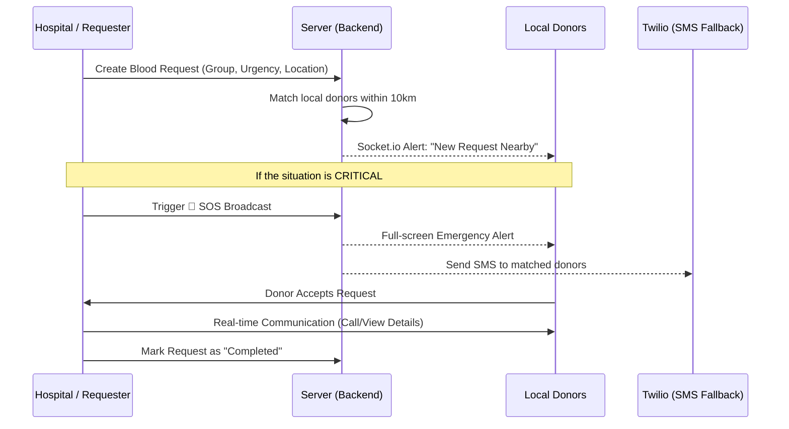

# 🩸 BloodConnector

**BloodConnector** is a real-time bridge designed to connect hospitals and blood banks with local verified donors during emergencies. It streamlines the blood donation process by using geospatial tracking, real-time notifications, and automated alerts to ensure that life-saving blood reaches patients when every second counts.

---

## 🚀 How it Works

The platform operates on a **proximity-based request system**. When a hospital or a user needs blood, the system identifies eligible donors within a specific radius (e.g., 10-50km) and notifies them instantly.

### 👥 User Roles
1.  **Hospitals**: Can create urgent blood requests, track donor responses, and trigger emergency SOS broadcasts.
2.  **Donors**: Receive real-time alerts based on their location and blood group, accept requests, and manage their donation history.

---

## 🔄 Project Workflow

### 🛠 Technical Architecture

*   **Frontend**: Built with **React 19** and **Vite** for a high-performance, mobile-responsive UI.
*   **Backend**: A **Node.js/Express** server handling authentication and request management.
*   **Real-time Logic**: Powered by **Socket.io** for instant notifications and SOS alerts across all active dashboards.
*   **Database**: **MongoDB** with Geospatial Indexing (`2dsphere`) to efficiently query donors by distance.
*   **Notifications**: Integrated with **Twilio API** for SMS fallbacks when donors are offline.

---

## 🏗 Setup & Installation

### Backend
1.  Navigate to `backend/`
2.  Install dependencies: `npm install`
3.  Configure `.env` (refer to `.env.example`)
4.  Start server: `npm run dev`

### Frontend
1.  Navigate to `frontend/`
2.  Install dependencies: `npm install`
3.  Configure `.env` (refer to `.env.example`)
4.  Start development server: `npm run dev`

---

## ✅ Key Features
- **Mobile Responsive**: Fully optimized for smartphones.
- **Geospatial Matching**: Automatically finds donors in a 10km radius.
- **Emergency SOS**: Escalate requests to alert all matching users instantly.
- **Smart Eligibility**: Automatically calculates if a donor is eligible based on their last donation date.
- **JWT Security**: Secure session-based authentication for both donors and hospitals.
 